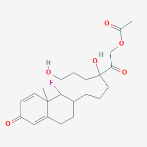
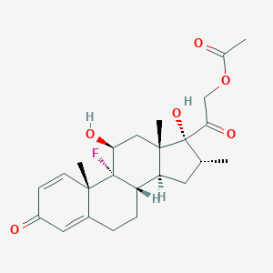

*tldr; please provide SMILES and/or InChIKeys in your papers!*

Most papers in the environmental chemistry literature describe compounds using their name and molecular formula. Often, lists of compounds are also found in the Supplementary Information, detailing e.g. what Internal Standards or Targets were used in the study.

In my work, I've relied on these lists as starting points for compiling my own datasets. Luckily, most are published in machine-readable formats like csv or txt (not pdf or doc!). However, I think there is room for improvement in the way we communicate the individual chemical compounds which make up these lists.

Commonly, compound names and their CAS Registry Number (aka CASRN or simply CAS)[1](#cas) are given in the Supporting Info [2](#anliker2020). Using CAS has its pros:

* it is relatively short (max. 10 digits)
* easy to communicate (just numbers and hyphens)
* generally well-known in the community
* has built-in check digit verification [3](#casdig), which allows users to make sure a certain CAS is valid.

However, from a cheminformatician's point of view, CAS is not a great identifier *per se*. Some cons:

* look-up always necessary as CAS are "random" and meaningless to the human eye unlike SMILES or InChIKey (2nd and 3rd block)
* related to previous point: CAS are not immediately operational - one can't calculate e.g. the molecular weight from a CAS alone, unlike a SMILES string
* not Open - they are the intellectual property of the American Chemical Society and have certain use limitations [4](#infopol) associated with that e.g. 5000 record limit 
* limited parseability using open cheminformatics toolkits (besides conversion services like Cactus, PubChem, and EPA Comptox, RDKit and CDK don't deal with CAS)
* specificity/granularity problems: e.g. in databases, compounds can have stereochemistry [unspecified](https://pubchem.ncbi.nlm.nih.gov/compound/3680) or [specified](https://pubchem.ncbi.nlm.nih.gov/compound/236702):

  

In the above examples, both stereoforms have the same CAS number associated (in PubChem): 1177-87-3 . In this case, how can we distinguish which stereoisomer is which, just from CAS number alone?

Considering these issues, I think SMILES and/or InChIKeys should be provided instead when communicating compounds in general.

(Thanks to Zhanyun Wang and Randolph Singh for interesting discussions.)

UPDATE 21/01/2021: Another con of using CAS as identifiers: not only can there be multiple (depending e.g. on the patent application status of that chemical compound), but sometimes, CAS numbers can be 'retired' and no longer become associated with that particular compound after some time in certain databases. 

\
\

---

### References

<a name="cas">1</a>: https://www.cas.org/support/documentation/chemical-substances/faqs

<a name="anliker2020">2</a>: A recent example: https://pubs.acs.org/doi/10.1021/acs.est.9b07085?goto=supporting-info

<a name="casdig">3</a>: https://www.cas.org/support/documentation/chemical-substances/checkdig

<a name="infopol">4</a>: https://www.cas.org/legal/infopolicy 

 
