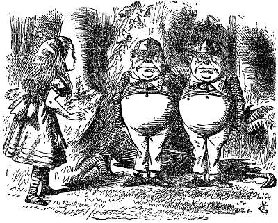

### Deleting one substructure match at a time

I recently came across this [post](https://github.com/rdkit/rdkit/discussions/4685) on RDKit Discussions about deleting one substructure match when there are multiple in the same molecule.

Specifically, the OP asked how to delete just one Cl *atom* at a time in his molecule that contains two of them.

This was really interesting for me because I worked on a similar problem recently (but with a twist!).

The problem is, `DeleteSubstructs` removes **all** substructures matching the query in a given molecule. Therefore, Greg suggested two ways:

1. converting the Mol to a rewritable molecule `RWMol`, then exploiting `RemoveAtom` functionality, and
2. using chemical reactions, which involves encoding the desired reaction into SMARTS.

But here's the twist - what if you want to delete an entire *substructure fragment match*, one at a time, when there are multiple in the same molecule? (By substructure fragment, I mean multiple atoms connected to each other.)

As far as I've seen, there is not yet any functionality in `RWMol` that can do this. On the other hand, one could use chemical reactions, but likely need to encode by hand the reaction SMARTS each time you have a different structure...

...which is fine if you're working with a few molecules you know very well, but if you are working with 1000s of molecules with very diverse structures, you want to be able to *remove the same substructure fragment from each molecule, one at a time* with minimal fuss.

I worked on this problem for my PhD and came up with a solution after several tries and thought to share it here.

Basically, I use `Chem.rdmolops.ReplaceCore()`.

`ReplaceCore`, and its counterpart `ReplaceSidechains` are typically used in medchem applications like R-group decomposition. In a way, it fragments a given molecule according to a substructure query match, then introduces dummy atoms at the sites of fragmentation, represented by a number and asterix like `1*`.

The beauty of this is that it 'removes' **one substructure match at a time** if there are multiple  in your structure.

I then simply replace the dummy atoms using `datamol`, a lightweight library built on RDKit. Calling [`dm.remove_dummies`](https://doc.datamol.io/stable/api/datamol.html#datamol.mol.remove_dummies) replaces the dummy with a hydrogen, but you could replace with whatever atom you want using `dm.replace_dummies_atoms()`.

Check it out:



It's perhaps an unorthodox (hacky?) solution for fragmenting molecules and deleting substructures, but it works for what I need.

I came up with this idea thanks to the great [documentation](https://www.rdkit.org/docs/GettingStartedInPython.html?highlight=replacecore#substructure-based-transformations) and related blogposts of RDKit as well as `datamol` - super helpful folks in the open source community!

I'm curious if there are better ways to remove one substructure match at a time from a molecule. Leave a comment or Tweet at me!

*Solving this problem was part of one of my PhD projects to develop an algorithm to classify homologous series. Check it out [here](https://github.com/adelenelai/classify_homologues).*

##### Further Reading
* [RDKit Blog - R-Group Decomposition](https://rdkit.blogspot.com/2019/12/using-r-group-decomposition-code.html)
* [More R-Group Decomposition](https://greglandrum.github.io/rdkit-blog/tutorial/prototypes/drawing/2021/08/07/rgd-and-highlighting.html)

