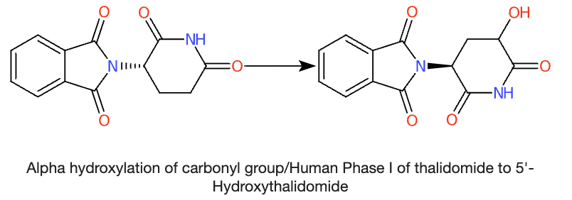

## MCS Tanimoto Similarity, 6000+ Transformations, Antimicrobial Resistance and Ecological Risk Assessment

*I'm back after a hiatus, and by hiatus I mean finishing my PhD (December 2022). I now work as a software developer at an environmental analytics company here in Luxembourg - more about that in a later post.*

> tl;dr: In this post, I discuss data curation of transformation products, molecular similarity calculation, and its use in the risk assessment of chemicals, based on a recent review paper by Löffler et al. 
>
> I'd like to believe there's something in this post for everyone - a little bit of cheminformatics, some environmental chemistry, and a generous sprinkle of environmental risk assessment. However, I admit it can sometimes get a bit technical, so I tried to explain in simple terms. 
>
>If you're here just for the code, [skip to it](https://adelenel.ai/tp-parent-similarity/#first-steps-in-risk-assessment-of-more-transformation-products).

I came across an interesting [review](https://doi.org/10.1021/acs.est.2c09854) published just ~~5 days~~ 3 weeks ago related to the **risk assessment of antimicrobials** in Environmental Science & Technology. 

This line in the abstract caught my eye: *"we propose evaluation of structural similarity between parent compounds and TPs for TP risk assessment"*.

Some context: there is concern about increasing antimicrobial resistance worldwide, as it poses threats to the health of humans, animals, and the environment. Antimicrobial resistance (e.g., to antibiotics) has been growing because of their widespread use, dating back to the discovery of penicilin in the 50s. 

In fact, antibiotic resistance is such a great concern that it's been the subject of multiple public awareness campaigns here in Luxembourg. For example, this pamphlet I found last week at my doctor's office, issued by the Luxembourgish Ministries of Health and Agriculture.



However, Löffler et al., focus not on antimicrobial compounds themselves, but rather their **transformation products (TPs)**. 

### Transformation Products

TPs are compounds that result from environmental transformations of so-called parent compounds, such as biodegradation and photolysis; basically, chemical reactions that happen when the parent compound enters the environment. For our purposes, human metabolism is also considered a transformation, often leading to the excretion of metabolites/TPs and discharge into the environment via wastewater. 

Here's an example of thalidomide (parent) transformed to 5'-Hydroxythalidomide.

The chemical structures of many TPs are still unknown, let alone identifiable in the environment, which is concerning especially since some of the TPs that *are* known have been demonstrated to be more bioactive (potentially toxic) than their parent compounds. 

Furthermore, in the context of antimicrobials, many conventional wastewater treatment plants have been ineffective in removing antimicrobial residues. Some may even produce "treatment TPs" that are discharged into aquatic environments, in addition to other TPs that would form in the environment.

In short:
> **many possible antimicrobial TPs may be present the environment, whose ecotoxicological risks are currently hard to estimate or quantify.** 

Scientifically, a very important (and interesting!) topic, tackled in the review.

### TP Risk Assessment 

I worked briefly on TPs during my PhD, trying to [curate them for PubChem to make TP data more FAIR](https://zenodo.org/record/7838005). Besides that, I also supervised an [internship](https://adelenel.ai/mentoring/) on this topic, so I was naturally curious about the **data and cheminformatics approach** the authors used in their review. 

In a nutshell, the authors calculated molecular similarity for TPs and their parent compounds in order to **estimate various Risk Quotients and EC50 values for Risk Assessment of Antimicrobial Resistance and Ecological Risk Assessment**. 

As many cheminf folks in drug discovery are likely familiar with EC50, I'll briefly explain Risk Quotients: 

Risk Quotients are calculated by dividing the exposure level by the acceptable effect level of a chemical. More formally:

> Risk Quotient = Measured Environmental Concentration / Predicted No Effect Concentration

The value of a compound's Risk Quotient can affect chemical prioritisation and possible risk mitigation measures such as restriction of the compound. 

If you're interested in these concepts, see below for links for Further Reading, but for now let's dive into the data and code.

### Chemical Data: Parents and Transformation Products
Löffler et al. worked with a total of 56 TPs manually curated from the literature. They list these TP compounds in their Supplementary Information, including structure information in the form of SMILES and InChIKeys in Table S3 (XLSX). 

It's great that people have started doing this now (I wrote about this topic 2+ years ago [here](https://adelenel.ai/communicatingenvchem/)). However as I wanted to spin up some quick cheminformatics analysis, a CSV or TXT file instead of XLSX would have been a bit more helpful for easier reading into Python or R without having to do any extra manual steps to pre-process the data (plus, XLSX is technically a proprietary format). 

As an example of what I mean, check out this [TXT file](https://pubs.acs.org/doi/suppl/10.1021/acs.est.2c00321/suppl_file/es2c00321_si_001.txt) I prepared for the SI of our [review on UVCBs](https://doi.org/10.1021/acs.est.2c00321). 

### Cheminformatics Approach: MCS Tanimoto Similarity between Parents and TPs
The authors calculated the **structural similarity between TPs and their respective parent compounds**, then classified them as either 'similar' or 'dissimilar' according to a similarity score threshold. In their approach, **whether a parent-TP pair is similar or dissimilar affects their Risk Assessment results** (see below).

Here, I will focus on 2D similarity, which was calculated in the article using the **MCS Tanimoto method** in ChemMine's [Similarity Workbench](https://chemminetools.ucr.edu/similarity/). 

MCS stands for Maximum Common Substructure, which is a well-known concept in cheminformatics. The name is relatively self-explanatory, but more formally, if you treat a molecule and its atoms as a graph made of edges (bonds) and nodes (atoms), the MCS is the largest common subgraph across the graphs of the query and target molecules. There are many different ways (algorithms) to calculate MCS implemented in various cheminformatics toolkits.

I had never heard of MCS Tanimoto before and was curious, especially since the original [ChemMine NAR paper](https://doi.org/10.1093/nar/gkr320) describes the underlying MCS algorithm as *often provid(ing) the most accurate and sensitive similarity measure, especially for compounds with large size differences*.

To understand how this MCS Tanimoto Similarity is calculated, I inevitably went to the ChemMine [source code](https://github.com/girke-lab/chemminetools/blob/1896c2dd7362f44193528aef028390543a125921/similarity/funcs.py#L88), that also led me to the [vignette](https://www.bioconductor.org/packages/devel/bioc/vignettes/fmcsR/inst/doc/fmcsR.html#52_Compute_MCS) of the underlying fmcsR package. 

From what I understood, ChemMine's MCS Tanimoto is:

> c / (a+b-c)
>
> where c =  number of atoms in the MCS
>
> a = number of atoms of the smaller molecule (a.k.a. the query, presumably the TP), and
>
> b = number of atoms of larger molecule (a.k.a. the target, presumably the parent compound).

I won't get into the cheminformatics weeds of this for now, but might blog about it more in upcoming posts. 

### Chemical Similarity in Antimicrobial Resistance and Ecological Risk Assessment
In the review, TP-parent pairs with MCS Tanimoto >0.95 are classified as 'similar', and <0.95 as 'dissimilar'. These classifications have implications for calculating:

1. **Risk Quotient of Antimicrobial Resistance (RQAMR)**
 
If a TP-parent pair is dissimilar, the Risk Quotient of the TP is calculated as being 10 times lower than that of a TP whose parent is deemed similar - "a lower effect potency was assumed". See the formula [here](https://pubs.acs.org/doi/10.1021/acs.est.2c09854?goto=supporting-info#eq2). 

2. **50% Effect Concentrations (EC50) and the Toxic Ratio in Ecological Risk Assessment**

The Toxic Ratio of a chemical, which is a quotient of baseline and experimental EC50 values, describes its cytotoxicity relative to its baseline toxicity. Toxic Ratios more than or equal to 10 typically indicate specific toxicity. In the review, a factor of 10 is applied to the EC50,specific values of dissimilar TPs compared to similar TPs which, for a constant EC50 value, means the Toxic Ratio of dissimilar TPs is lower than that of similar TPs. Formula [here](https://pubs.acs.org/doi/full/10.1021/acs.est.2c09854#eq10).

The main takeaway here is:

> *how* molecular similarity is calculated affects whether a TP is deemed similar/dissimilar to its parent, which in turn affects Antimicrobial Resistance and Ecological Risk Assessment

In other words, the cheminformatics method used for calculating Similarity between TP and parent molecules *matters*.

### First Steps in Risk Assessment of more Transformation Products
I asked myself if and how we could apply some of these concepts to more TPs to try to further the Risk Assessment of TPs (assuming the applicability domains of these concepts extend beyond antimicrobials and can be applied to other chemicals in general).

In Section 2.2 of the paper, Löffler et al. mention that the threshold for similar/dissimilar classification is 0.95 (MCS Tanimoto Similarity) - "these values agree with the known activity loss of beta-lactam TPs via ring opening". 

I'm curious to understand this a little better, but in general in cheminformatics, I don't think there is a widely accepted cutoff for 'traditional' Tanimoto similarity, especially because there are so many ways to calculate chemical fingerprints, e.g.,substructure keys like MACCS, circular like ECFP4, topological like Daylight etc.

Nevertheless, for the purpose of this post, I wanted to demonstrate some **first steps towards applying Transformation Product Risk Assessment on a larger dataset of TPs**. 

More concretely, I will classify TPs as similar/dissimilar to their parents according to Löffler et al's 0.95 threshold, albeit using a different similarity metric. (The reason I use a different similarity metric is because MCS Tanimoto has not been implemented in my cheminformatics toolkit of choice, the RDKit.)

As the data and metrics are different, any sort of comparison is of course limited for now, but the point is to demonstrate how the concepts in the review could be applied to a larger dataset.

Below, I'll show how I downloaded, processed, calculated similarity, and classified over 6500 parent-TP pairs.

### Calculating and Classifying Parent-TP Similarities 
First, I downloaded the latest version of [Transformations in PubChem](https://doi.org/10.5281/zenodo.7838005), specifically the 'wExtraInfo.csv' version (April 2023) which currently has 6554 entries. These entries represent documented transformations, with structural info on the parent and transformation product molecules.

After some preliminary data exploration, I then calculated Molecular Similarity using RDKit. As far as I know, RDKit does not have a built-in MCS Tanimoto similarity function identical to ChemMine's, so I used the Morgan Fingerprint. 

(Note that unlike ChemMine's method that calculates Tanimoto based on MCS, this approach first calculates molecular fingerprints, then does the Tanimoto calculation using the equation above on the numbers of 'on' bits.)
 
Lastly, I classify TPs as being either similar or dissimilar to their parents using the same threshold of 0.95 described in Löffler et al. Ideally, I would evaluate the similarity of a beta lactam and its TP upon ring opening and use that as a benchmark for each similarity method, but I'll keep it simple for now.



Feel free to use the code, I'd be grateful if you could attribute me:
> Adelene Lai. (2023). Cheminformatics for Risk Assessment of Transformation Products (v0.0.1). Zenodo. https://doi.org/10.5281/zenodo.8079917

### Final Thoughts
Now that we've classified our 6500+ parent-TP similarities, what's next?

Ideally, we would have Measured Environmental Concentration and Predicted No Effect Concentration data available for these compounds so we can calculate all their Risk Quotients. 

However, I believe such data are scarce, and risk assessors tend to have to resort to modelling MECs using fate-transport models and PNECs using QSARs for now.

On top of that, the elephant in the room of course remains - how many of Löffler's 56 TPs would be classified as similar/dissimilar to their respective parents using a different fingerprint/similarity metric (like ECFP4-Tanimoto)? This was not in scope of the current post, but stay tuned for a possible next post on this.

Happy to discuss this further!

### Further reading
1. [Risk Assessment](https://doi.org/10.2166/9781789061987)
2. On MCS Tanimoto, see this [issue on Chemmine Github](https://github.com/girke-lab/chemminetools/issues/172), [Cao et al.](https://doi.org/10.1093/bioinformatics/btn186), [Zhang et al](https://doi.org/10.1007/s10822-015-9872-1), and this discussion in the RDKit community [here](https://github.com/rdkit/rdkit/discussions/6265). 
3. [RDKit Blog](https://greglandrum.github.io/rdkit-blog/) - full of awesome stuff in general, I learn a lot from it.
4. Fingerprints in the RDKit: [here](https://www.rdkit.org/UGM/2012/Landrum_RDKit_UGM.Fingerprints.Final.pptx.pdf) and [here](https://greglandrum.github.io/rdkit-blog/posts/2023-01-18-fingerprint-generator-tutorial.html)

*Credits to the PubChem-ECI team for their continued work on Transformations, thanks to Jonas for discussing cheminformatics with me, and a shoutout to Beate Escher and Martin Scheringer, whose lecture introduced me to Environmental Risk Assessment almost a decade ago - it's a big reason why I went into environmental chemistry :)*

