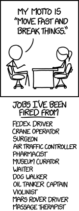
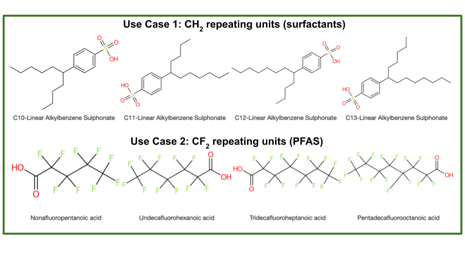
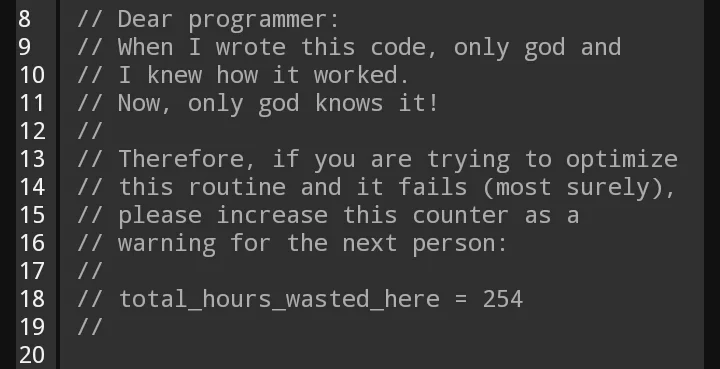

### What I was thinking vs. what I think now

> If you're new to Green Cheminformatics, hello I'm Adelene.
> I'm currently a software developer at an environmental analytics company in Luxembourg. 
> I studied Environmental Chemistry. I never thought I'd end up writing code for a living*.
> My PhD used cheminformatics to **identify and manage unknown chemical pollutants in the environment**. 
> During my PhD, I wrote a [cheminformatics algorithm named after a pineapple](https://jcheminf.biomedcentral.com/articles/10.1186/s13321-022-00663-y),
> reviewed [UVCBs](https://pubs.acs.org/doi/10.1021/acs.est.2c00321), and supported [Luxembourgish](https://pubs.acs.org/doi/10.1021/acsenvironau.1c00008) and [Swiss](https://enveurope.springeropen.com/articles/10.1186/s12302-021-00475-1) authorities, helping them identify chemicals in their waters.
> Inspired by colleagues at the Steinbeck Group, I also dipped my toes into the world of natural products and yapped about it [here](https://adelenel.ai/sugarfreecoconut/).

Not long ago, I joined a small company here in Luxembourg called [WEO](https://www.linkedin.com/company/weo-water/). 

WEO uses Open satellite data to monitor how trees grow and temperatures change in cities over time. 

The idea is to provide cost-effective, long-term monitoring for various stakeholders - our clients range from municipalities and urban planners to railways.

I really like WEO's mission - to provide *environmental analytics for all from space*. 

It's been 6 months since I started as a software developer at WEO, and I'm learning a lot so far. 

However, I still work on a few cheminformatics projects in my free time, and it's made me reflect on how different my approach to writing code has become. 

So in this post, I thought I'd share some things I wish I knew or would have done differently during my 
PhD.

As a software dev, I code and think about code very differently now; R&D and Software Development are of course, two different beasts altogether. 

But especially since I still work on R&D projects in my free time, I occasionally feel the pull of old coding habits from my time in research. 

It's like being in [Two Places At Once](https://www.youtube.com/watch?v=I1MBgIchMxM), like Mandy Moore in *A Walk to Remember* (yes, that tearjerker from the 2000s - c'mon, I'm a 90's kid).

Here's what I do differently now as a software dev compared to when I was doing R&D:

##### 1. I cull failing code ruthlessly now
In research, I would have an idea, write some code, see it fail, comment it out, then try something else...

...find it fails again, comment it out, try something else...

...and repeat. 

It's research after all, it's supposed to fail *n+1* times, no?

Old Me had the habit of commenting out failing code instead of deleting it because it represented a *scientific idea* I wanted to 'keep', thinking I would revisit it in the future. 

However, I inevitably often ended up with scripts and Jupyter notebooks that were super long and full of commented-out code. In hindsight, I only occasionally looked at or reused such code.

As a dev (New Me), I now see commented-out code as distracting or even confusing - *should I build this or not?* 

More importantly, I realised that if you are pushing code regularly to GitHub, there's no need to keep that commented-out code in your script because you can recover it from your commit history (obvious I know, but it took someone to point that out for it to really sink in).

In research, I didn't push code updates as regularly as I do now for various reasons (see next point), but if I could go back, I would do myself the following favours:

* push code updates more frequently, even if changes are mildly incremental
* try to keep my scripts short and clean -  cull useless code *yesterday*

This brings me to the next point...

##### 2. I commit and push code to GitHub more often 
In research I was the only person working on my code 99.9% of the time.

However, I now **code in a team**, and inevitably need to share code more frequently because team members would build other parts of the codebase that depend on my code. 

Also, now that I've started working more with **cloud technologies**, pushing code is the only way I can test on the cloud (at least in the way it's currently set up). 

For example, I would need to push new code to rebuild Docker containers that run on remote servers, calling inputs from cloud storage.

But if I'm honest with myself, I think the main reasons I commited and pushed code so infrequently when I was doing research were:

1. I felt self-conscious about 'publishing' ugly, possibly ill-functioning or buggy code. 
2. Since I was mostly working alone on my project, there was no immediate need to push code to GitHub, so I often didn't see the need to, or just got lazy.

Point 1 can be a doozy, especially for researchers. (Shoutout to Sam Harrison, with whom I'd started [discussing](https://www.linkedin.com/feed/update/urn:li:activity:7099089545412964352?updateEntityUrn=urn%3Ali%3Afs_feedUpdate%3A%28V2%2Curn%3Ali%3Aactivity%3A7099089545412964352%29) this with on LinkedIn.) Personally, I've experienced this feeling, but also seen it in at least 4 other colleagues during my time in research.

I think researchers have a tendency to be 'careful' about what we put out there, because we subconsciously conflate pushing code with submitting the final version of a manuscript, which may be cited by others. 

The reality is, there is no *final version* of code in the same way there is a final version of a paper on the cusp of submission (or publication for that matter).

There are always ways to enhance or optimise code, so really, it's never considered 'done' in the same way a paper is 'done' when it's submitted and published. 

(And there will always be bugs.)

I now see code should be an avenue for experimenting - failing code or ugly code is not necessarily a bad thing. 

'Failure' in this sense, I was told, should not be associated with something negative; it's just a message to us the programmer that our current approach doesn't work and that we need to try another.

Then there's also the fear of 'people are going to judge my ugly code and think I'm a bad scientist'.

If I could go back in time, I would have reminded myself to stop caring. If anything, committing and pushing frequently lets you backtrace easier (and revisit ideas, see previous point).

In most cases, writing software is not the same as doing research because the way I see it, code itself is not the intended product of research. Rather, it's our attempt to answer the research question that is important, with programming as a means of getting there. 

So, let's Move Fast and Break Things :D

(And as usual, there's an XKCD for that.)

There is one more point I want to address that did not really affect me, but that I've seen other researchers concerned about when it comes to pushing code regularly in public repos, and that is the **fear of being scooped**. 

I have lots of thoughts on this, and will save this for another post.

##### 3. I use coding tools that make my life better
I now use an **autoformatter** (Black in VSCode).

Previously, I used to mostly develop in Jupyter Notebooks. I liked being able to visualise my results instantly in cells, and to run code cell-by-cell. 

Then when my code was >70% complete, I would switch to using a text-editor like Atom to be able to run it as a script, especially if I wanted to call it from the command line.

I followed this workflow when developing [OngLai: a cheminformatics algorithm to classify homologous series](https://github.com/adelenelai/onglai-classify-homologues).

But *wow*, what was I doing?! (or rather, not doing...)

I read somewhere that our brain should be focused on harder tasks like research, instead of being distracted by trivial things like making sure code is properly formatted. (VSCode has plenty of cool advantages over Jupyter Notebooks - syntax highlighting, linking to code definitions etc.)

I would also recommend **linting**. 

Linting is different from Formatting because it analyzes how the code runs and detects errors whereas formatting only makes it look good on the page.

I didn't use autoformatting or linting during my PhD and wish I had!
(Shoutout to [Charlie Tapley-Hoyt](https://cthoyt.com/) who introduced me to these tools in one of his Python packaging webinars.)

Not to mention one can now use ChatGPT, but that came out post-PhD and is another story.

##### 4. Tests
This is a tricky topic. 

If I think about it now as a dev working with big code bases containing functions that are called in multiple places, tests are *essential*, because changing a single line of code could cause many other things to break unexpectedly.

Tests should *help* you, not hinder.

In that sense, I see writing and doing regular tests help me avoid nastier problems in the future (I call pytest every time before I commit, sometimes even before staging code).

But do we really need tests in research code?

If I think back to my experience developing [OngLai](https://github.com/adelenelai/onglai-classify-homologues), the 'tests' I developed and regularly used were not software-related but rather chemistry-related. 

For example, my 'tests' tried to address questions like...

*Does OngLai cover chemical compounds with CH2 repeating units? And also CF2? CH2O2?* 

*What about cases where we have branched compounds, not just linear? How would fragmentation work there?*

*What about different stereochemistries of the same compound?*

In a sense, it's all about the use cases - does my code cover the intended use cases?

But also, as I initally worked with one long script that had to be run start-to-finish, I did not really separate things out as small functions.

Therefore,  I'm not sure it would have made sense to do unit tests at the time. (*NB Looking at the code now, I just realised I even forgot that I had indeed made smaller functions. Probably could have tested those...but I think I did this really late and just wanted to submit the darn thing.*)

Then there's the question of testing something already in production. 

I learned that it does not make sense to write tests for stuff already in production, especially if it was mainly written by others, and to focus on testing things I was working on in development.

For OngLai, I'm not sure when 'development' (in the software sense) ended, and 'production' really began.

That said, if I could go back, I would definitely have done things differently. 

For one, I think I have more of a 'coder's' mindset - trying to separate things into functions that are as small as possible.

I think this only makes sense and is worth doing if there is reusability foreseen for that function. At the time though, it was difficult to know how the algorithm would progress, and whether I would need to call certain lines of code again.

*Ah* the trials and tribulations of research... :D

-----------------------

Overall, I *think* I've become a better coder overall (good mentorship helps). I work quicker, learn quicker, and (hopefully) write code that not only God understands.

If you stuck with me to the end, thanks for reading these rambles, feel free to leave a comment below - I'd love to know what you think.

Ever onward!

> * The only Computer Science course I ever took was "Scientific Databases", an elective during my exchange semester in Chemistry at ETH. On at least 2 occasions throughout the semester, the TAs thought I was lost and in the wrong department (which I technically 'was', but I was coming from the liberal arts - you were expected to study outside the department!). We learned about RDBs, views, querying, relations - all that good stuff. At the oral exam at the end of the semester, the professor asked me about XML and was shocked I didn't know what it was. I still remember his face when he asked me "you've never heard of XML?". Anyway, I passed the course, but it was tough - academically, but also spiritually (...). I'm glad I did it though. I learned a lot.

