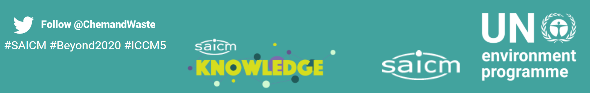
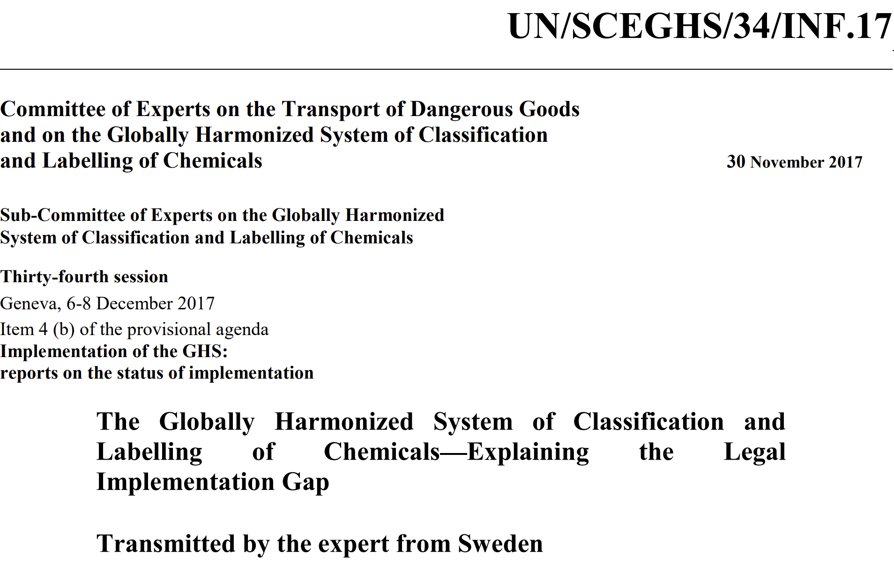

### Looking forward (and back) on my work in Chemicals: focus on GHS

In Bonn, scientists, policy-makers, NGOs, and industry are gearing up for a week of intense discussions about how chemicals and waste should be managed on an international level.

The fifth International Conference on Chemicals Management (ICCM5), organised by the United Nations Environment Programme (UNEP) together with the German government, will take place next week. 

ICCM5 falls under SAICM, a framework under UNEP that stands for the *Strategic Approach to International Chemicals Management*.

After years of postponements and Intersessional Meeetings, in which amongst other things, SAICM's post-2020 future was deliberated at length, I'm (cautiously) hopeful for the outcomes of ICCM5. #Beyond2020

#Beyond2020 - the hashtag is real. Screenshot of the SAICM website footer.

> *SAICM was established in 2002, aiming to achieve sound management of chemicals and waste throughout their life-cycle by 2020.*
>
> *It's now 2023 and well...we still have weekly news of environmental contamination, chemicals found in human samples, and taglines like "Forget Diamonds, PFAS are Forever". Clearly, more work needs to be done #Beyond2020...*

I'm especially looking forward to the Side Event on the Science Policy Panel, as its potential for impact is massive.

I think (hope) the Side Event will be a fruitful culmination of the determined efforts of the SAICM Open Ended Working Group over the years during the Intersessional period. 

The goal? 

**Establish a Science Policy Panel on Chemicals and Waste.**

##### A quick look back

I participated in the previous ICCM in Geneva, back in 2015. 

At the time I was just 22, and attending ICCM4 was the highlight of my summer internship in the Chemicals and Governance Unit at the Stockholm Environment Institute (SEI). 

I still remember taking the train from Zurich to Geneva. I had just started my first semester of the MSc. at ETH, and back then the ticket cost 90+ Swiss Francs. It seemed a lot at the time, but it's probably a lot more now!

It was my first time at such a high-level conference attended by both scientists and policy-makers (which, as I later found out during my time in research, is quite a rarity...we work in silos...)

That summer, I had done a summer internship at SEI working on GHS - work that eventually became this [publication](https://doi.org/10.3390/su9122176). 

At the time, I remember the manuscript was still in its very early stages, but we nevertheless printed out physical copies of the draft to share with ICCM participants at our conference booth to get feedback. 

After it was published, we submitted it as an expert transmission to the 34th Session of the Sub-Committee of Experts on the GHS.

Some might wonder why I am interested in this aspect of chemicals and waste, and how I've been working on this topic for so long (I count 8+ years, so more than a quarter of my life). 

In particular, Luxembourgish readers of this blog may be puzzled or surprised, as I rarely talk about these issues whenever I meet them at local events.

> *Wasn't she just on RTL Today, promoting the Luxembourgish Science Slam?*
>
> *I thought she works as a software developer at a spacetech company.*

I *was* on the radio talking about [science communication](https://play.rtl.lu/shows/en/in-conversation-with-lisa-burke/episodes/n/2109419) and the recent [Science Slam](https://play.rtl.lu/shows/en/the-home-stretch-with-melissa-dalton/episodes/r/2109965), and *do* work as a software developer at WEO.

The fact is, in Luxembourg, there is relatively little activity on developing chemicals policy at an *international* level (at least, that I am aware of...happy to be corrected). 

Being part of the EU, Luxembourg's chemical policies should of course be aligned with what has been set out at the Union level. 

That said, Luxembourg's national glyphosate ban, albeit shortlived, *was* highlighted as an exemplary success at the [recent meeting]((https://multimedia.europarl.europa.eu/en/webstreaming/committee-on-environment-public-health-and-food-safety_20230718-1700-COMMITTEE-ENVI) ) of the the EU Parliament's Committee on Environment, Publich Health, and Food Safety by Luxembourgish MP Tilly Metz recently, which I followed with avid interest via livestream...

However, my interest in chemicals and waste actually predates my time in Luxembourg. 

In fact, my work in this area goes back to 2014 when I studied at ETH on exchange in the Chemistry department and took the course "Environmental Assessment of Chemical Products" as an elective, then interned at SEI in 2015.  

Ever since, I've had valuable opportunities to work on this important topic, particularly with the International Panel on Chemical Pollution on various SAICM/UNEP projects, amongst them, a workshop under the SAICM Quick Start Programme to train government officials from Armenia, Ghana, and Chile on environmental chemical modelling. 

Besides that, in addition to my MSc and PhD research, I have also contributed to various UNEP report and science-policy workshops and reports, including the one that spurred the 2018 [**Zurich Statement on Future Actions on PFASs**](https://ehp.niehs.nih.gov/doi/10.1289/EHP4158), UNEP's 2019 [**Global Chemicals Outlook II**](https://www.unep.org/resources/report/global-chemicals-outlook-ii-legacies-innovative-solutions), and a [**Mapping and Gap Analysis on the Science-Policy Interface in International Chemicals Governance**](https://www.ipcp.ch/wp-content/uploads/2019/02/IPCP-Sci-Pol-Report2019.pdf).

Therefore in this series of posts, I especially want to look ahead, focusing on events of the upcoming ICCM5 programme that are particularly interesting to me, and share some thoughts on chemicals management and pollution research from the perspective of a young scientist (based in Luxembourg, trained in Switzerland).

However, on the occasion of the eve of ICCM5, I thought it apt to also reflect on my personal experience working in this area, and perhaps some hopes for the future.

##### Looking forward: Supporting implemention of GHS - a ICCM5 Side Event
The Globally Harmonised System of Classification and Labelling (GHS) has undergone at least 8 revisions since 2002, and was originally developed under the Committee of Experts on the Transport of Dangerous Goods to facilitate the safe trade of chemicals, particularly across borders.

Some might recognise its most popular manifestation: those pictograms on the side of a chemical bottle denotings its potentially hazardous or toxic properties.

In our [paper](https://doi.org/10.3390/su9122176), we argued that the GHS is a cornerstone of safe chemicals management, being a *preventive* measure at the international level, as it addresses the distribution of a chemical, even before its use and release.

We also found that its full implementation was lacking, particularly in low income countries. 

Having worked on this topic, and 6 years on since the publication of our paper, I am naturally interested in the fact that its effective implementation is still a topic for discussion. 

However, I am admittedly unsurprised, knowing the challenges of global implementation and the fact it is a voluntary measure requiring effective government mandates and community education to help understand labelling and instructions.

Therefore, at the upcoming Side Event of ICCM5, I am particularly interested in how the roles of the ILO and UNITAR will continue to interplay with SAICM's, especially as we identified capacity-building and knowledge transfer as a critical step to assist in its implementation (for example, SAICM QSP projects supported by UNITAR in Zambia and Barbados, have aimed to address this gap in the past).  

*Stay tuned for Part 2 of **All Eyes on Bonn** and feel free to leave a comment!*

